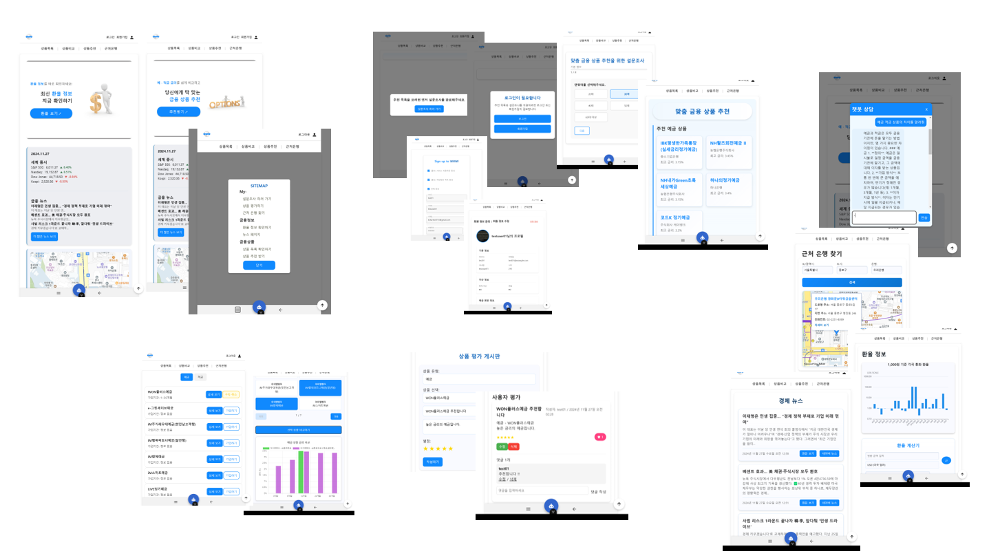
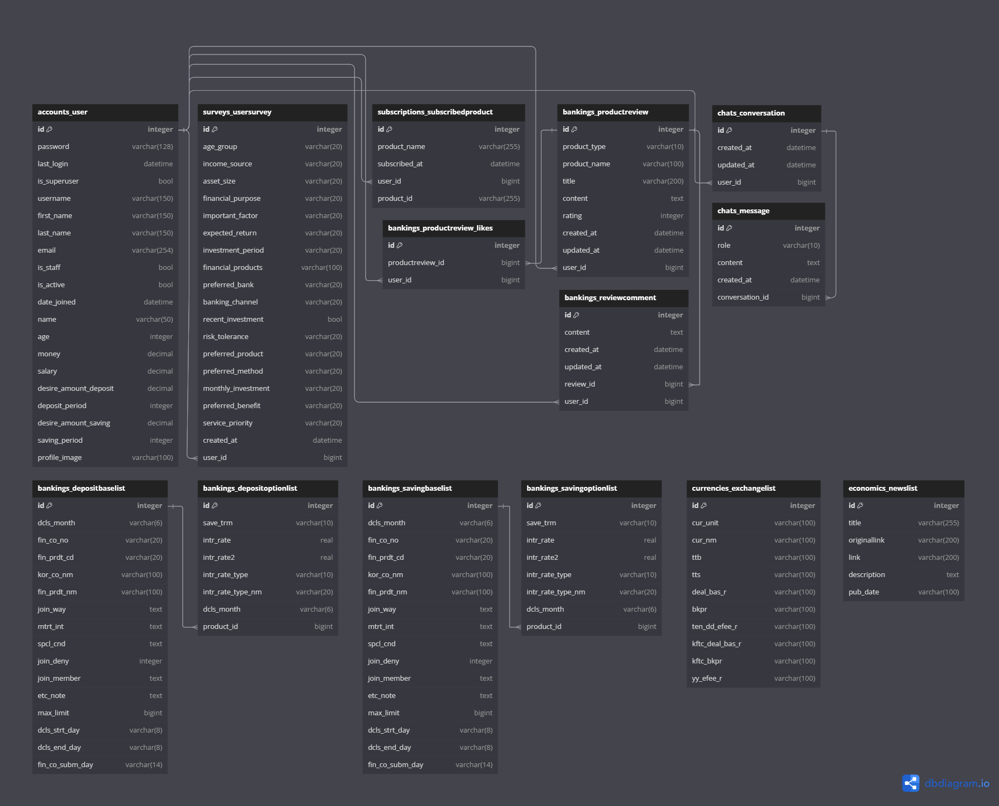
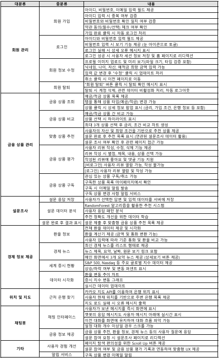
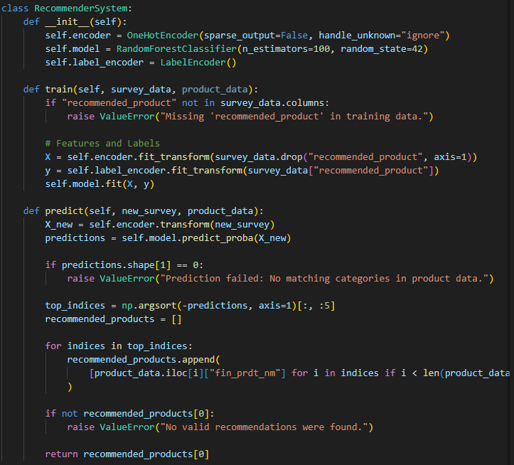
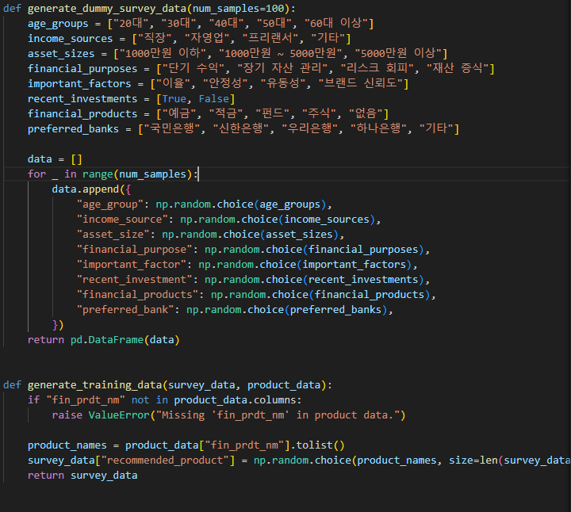
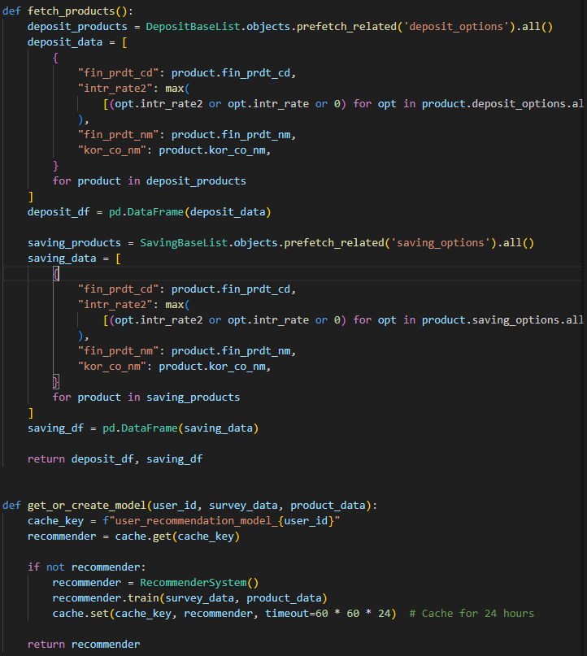

#   WWW


## 팀원 정보 및 업무 분담 내역
- 프로젝트 기간 : 2024/11/18 ~ 2023/11/26 (약 9일)

|이름|역할 및 구현 기능|
|---|---|
|박진수 (팀장) |Front End - 발표자료, 기획 전반, 디자인 전반, 회원가입, 로그인, 마이페이지, 홈, sitemap, navbar, sign in/up 유도 라우팅, 금융 상품 비교, 캐러샐 및 프론트 전반, 주변 은행 검색, 상품 관리, 상품 추천, 금융상품 추천 알고리즘 |
|김찬호|Back End - ERD, 회원 커스터마이징, 환율 정보 저장 및 업데이트, 금융 상품 회원 저장, 게시판 CRUD, 유저 프로필 수정 기능, 금융 상품 정보 저장 |

## 설계 내용 (아키텍처 등) 및 실제 구현 정도
### 기술 스택
**front**

- language
    - javascript
- framework
    - Vue3
    - pinia (+pinia-plugin-persistedstate)
    - vuetify
    - axios
    - stores

**back**

- language
    - python
- framework
    - django
    - django-rest-framework
    - dj-rest-auth
    - drf

## 페이지 개괄


## 데이터베이스 모델링(ERD)


## 기술 명세



## 추천 알고리즘 
### 주요 구성 요소 및 아키텍처
- 주요 목표: 사용자 설문 데이터를 바탕으로 금융 상품을 개인화된 방식으로 추천.
- 구성 요소:
  - Survey Data: 사용자 입력 데이터 (나이, 자산 규모, 금융 목적 등).
  - Product Data: 금융 상품 정보 (금리, 상품명, 금융사 등).
- 추천 시스템 클래스: RecommenderSystem을 통해 학습 및 예측.
<br><br>
- 핵심 로직
   (1) 훈련 데이터 생성
      사용자 설문 데이터와 금융 상품 데이터를 결합하여 훈련 데이터 생성.
      설문 데이터:
         설문 항목: age_group, income_source, asset_size, financial_purpose, important_factor 등.
         설문 데이터를 범주형 변수로 처리 (예: One-Hot Encoding).
      상품 데이터:
         상품 특성: fin_prdt_cd, intr_rate2(최대 금리), fin_prdt_nm, kor_co_nm 등.
         max 금리를 기준으로 상품을 정리.
      결합: 설문 데이터에 임의의 추천 상품(recommended_product)을 추가하여 학습 가능 데이터 생성.
   (2) 모델 훈련
      모델: RandomForestClassifier 사용.
      선택 이유: 범주형 변수 처리 능력, 과적합 방지, 해석 가능성.
      매개변수: n_estimators=100, random_state=42로 설정.
      훈련 데이터 처리:
         OneHotEncoder로 설문 데이터를 범주형 변수로 인코딩.
         LabelEncoder로 추천 상품 레이블을 숫자로 변환.
      훈련 과정:
      <br><br>
      ```python
      X = self.encoder.fit_transform(survey_data.drop("recommended_product", axis=1))
      y = self.label_encoder.fit_transform(survey_data["recommended_product"])
      self.model.fit(X, y)
      ```
      <br><br>
   (3) 예측 및 추천
      사용자 설문 데이터를 입력으로 받아 예측 확률(predict_proba) 계산.
      상위 5개의 확률이 높은 상품을 추천:
      <br><br>
      ```python
      top_indices = np.argsort(-predictions, axis=1)[:, :5]
      recommended_products = [
         [product_data.iloc[i]["fin_prdt_nm"] for i in indices if i < len(product_data)]
      ]
      ```
      <br><br>
      오류 처리:
         매칭되지 않는 경우 예외 처리.
         추천 상품이 비어 있는 경우 에러 반환.
   - 데이터 흐름 및 설계
   - 데이터 흐름:
      사용자 설문 입력 → 전처리 (인코딩).
      금융 상품 데이터 로드 (DB에서 Fetch).
      모델 훈련 또는 캐시에서 로드.
      추천 상품 예측 및 반환.
   - 모듈화 설계:
      RecommenderSystem: 학습과 예측의 핵심.
      fetch_products: DB에서 상품 데이터를 가져오는 유틸리티.
      generate_training_data: 훈련 데이터를 생성하는 헬퍼 함수.
      <br><br>
   - 주요 기술적 결정
      One-Hot Encoding: 범주형 데이터의 정확한 표현.
      Random Forest:
      추천 로직의 복잡성 처리.
      다양한 특성의 상호작용 고려.
      Caching:
      사용자 맞춤형 모델을 캐시에 저장해 응답 속도 향상.
- 추천 시스템의 강점
   개인화: 사용자의 특성과 금융 상품 간의 정확한 매칭.
   확장성: 새로운 금융 상품 추가 시 빠른 업데이트 가능.
   효율성: Django 캐시를 활용한 모델 재훈련 비용 감소.
   다양성: 확률 기반 추천으로 다양한 옵션 제시.
- 코드 예제



- 데이터베이스와의 통합
Django Models:
DepositBaseList와 SavingBaseList 모델을 사용해 DB에서 금융 상품 Fetch.
ORM을 활용하여 prefetch_related로 옵션 데이터를 효율적으로 조회.
데이터 저장 형식:
상품 데이터는 Pandas DataFrame으로 변환.
각 상품의 최대 금리(intr_rate2)를 계산해 추천 기준 설정.


## 느낀 점, 후기
* 박진수 : 머신러닝 분류 작업에서 기준치에 대한 명확한 이해가 부족했다 사료돼, 예측의 정확도가 아쉬웠다. 객체를 학습하는 과정을 발전시키고싶은 욕심이 생겼다. <br> 백엔드의 필드들을 미리 정리하고 필요한 부분을 표시해가며 개발해야하는 필요성을 뼈저리게 느꼈다. 또한 디자인과 배치를 좀 더 미리 설정하고 구현할 수 있도록 피그마나 프론트엔드 측면에서 다른 배움의 과정의 진행할 예정이다.

* 김찬호 : Python 및 Django를 활용하여 Back 개발을 수행하며 django app 및 각 models의 관리가 철저하게 관리 되어야 함을 학습하였으며, 초기 기획 단계에서 얼마나 프로젝트를 구체적으로 계획하느냐에 따라 향후 개발 프로젝트 수행 중에 마주할 문제점들을 최소화할 수 있다는 것을 경험하였습니다.
뿐만 아니라, 개발 프로젝트 진행 시에는 back과 front로 업무를 분할하여 코드 작성을 진행하지만, 개발 프로세스를 고려하면 분업보다 협동의 마음가짐으로 협력이 중요하다는 것을 학습하였습니다. 